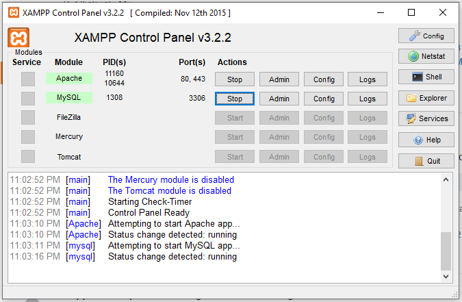

##S T E P S
---------------------------
1. Open the `Shell` Command line interface fron Xampp Control Panel.

2. Then enter the following command into the shell:
```
mysql -h localhost -u root
```
3. Then Enter `use db_name` <em>(replace db_name with database name)</em>
4. Then Enter `source path_to_sql` <em>(c:/user/desktop/sql.sql)</em>the sql file name

------------------------------**---------------------------------------**----------------